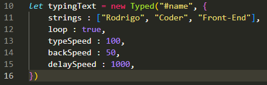
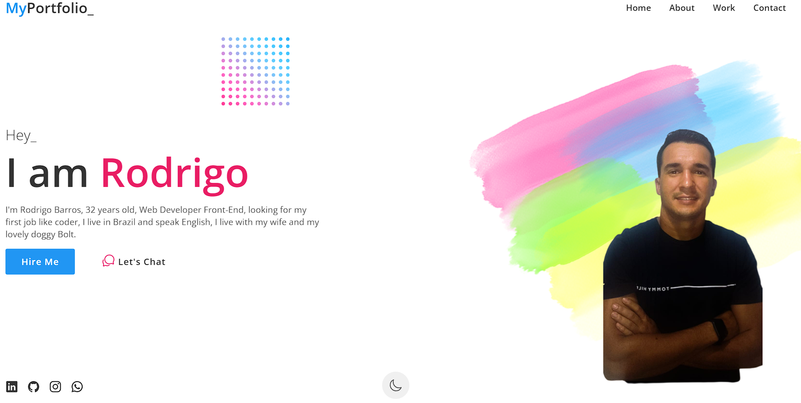
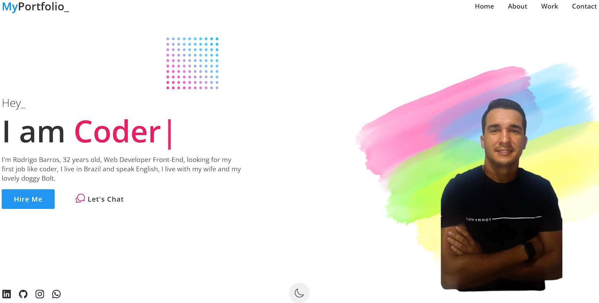
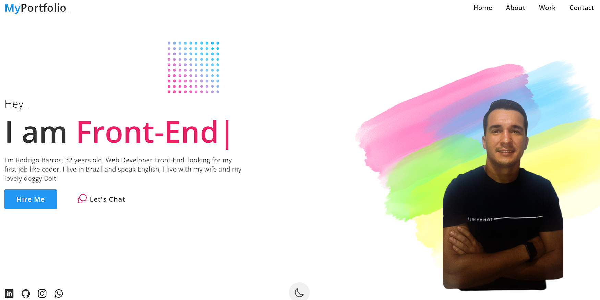
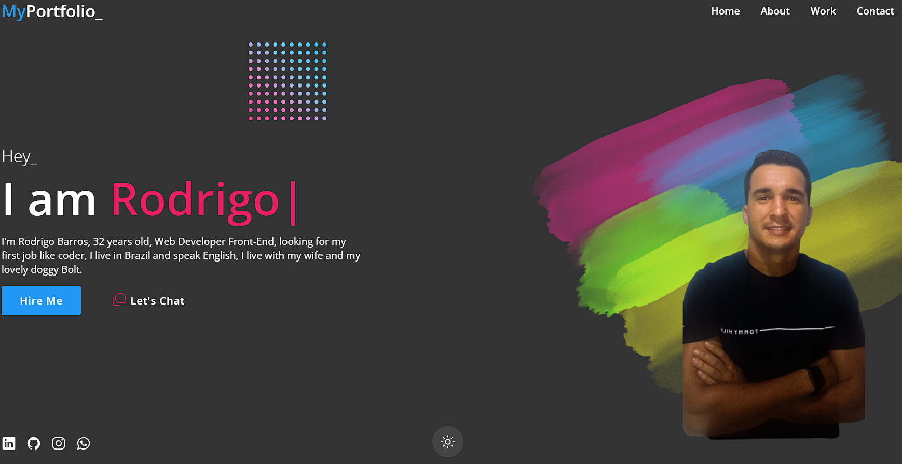

<h1 align="center">:triangular_ruler: Landing Page Portfólio</h1>

# :memo: Índice
* [:chart_with_upwards_trend: Proposta](https://github.com/rodrigobarros2802/my-portfolio/edit/main/README.md#chart_with_upwards_trend-proposta)
* [:trophy: Desafio](https://github.com/rodrigobarros2802/my-portfolio/edit/main/README.md#trophy-desafio)
* [:hammer_and_wrench: Tecnologias](https://github.com/rodrigobarros2802/my-portfolio/edit/main/README.md#hammer_and_wrench-tecnologias)
* [:dart: Objetivo]()
* [:open_book: Aprendizado]()
* [:camera: Imagens do Projeto]()
* 1. [:iphone: :computer: :desktop_computer:Responsividade]()
* 2. [:movie_camera: Vídeo Apresentação do Projeto]()
* 3. [:iphone: Mobile]()
* 4. [:computer: Tablet]()
* 5. [:desktop_computer: Desktop / Notebook]()
* [:link: Links]()
* [:technologist: Autor]()

<h1 align="center">:chart_with_upwards_trend: Proposta</h1>
<h3 align="center">Projeto desenvolvido com o propósito de enriquecer meu portfólio e criar uma identidade minha, facilitando o contato dos recrutadores.</h3>

<h1 align="center">:trophy: Desafio</h1>
<h3 align="center">Me arriscar cada vez mais na Linguagem Java Script usando arrays.</h3>

<h1 align="center">:hammer_and_wrench: Tecnologias</h1>
<h3 align="center">Java Script</h3>
<h3 align="center">HTML5</h3>
<h3 align="center">CSS</h3>

<h1 align="center">:dart: Objetivo</h1>
<h3 align="center">Criar um portfólio exclusivo para mim e assim sendo, usa-lo como minha página com todas as minhas informações.</h3>

<h1 align="center">:open_book: Aprendizado</h1>
<h3 align="center">Estou cada vez mais me dedicando e encarando Java Script, dessa vez tive o privilégio de desenvolver e praticar JS e aplicando arrays.</h3>

<h1 align="center">:camera: Imagens do Projeto</h1>

<h3>Imagem 1</h3>

<h3>Imagem 2</h3>

<h3>Imagem 3</h3>

<h3>Imagem 4</h3>

<h1 align="center">Responsividade :iphone: :computer: :desktop_computer:</h1>

<h1 align="center">:movie_camera: Vídeo Apresentação do Projeto</h1>

<h1 align="center">:iphone: Mobile</h1>

<h1 align="center">:computer: Tablet</h1>

<h1 align="center">:desktop_computer: Desktop / Notebook</h1>

<h1 align="center">:link: Links</h1>
<h3 align="center">Deploy GitHub Pages - https://rodrigobarros2802.github.io/my-portfolio/</h3>

<h1 align="center">:technologist: Autor</h1>
<h3 align="center">LinkedIn - https://www.linkedin.com/in/rodrigobarros2802/</h3>

<h3 align="center">GitHub - https://github.com/rodrigobarros2802</h3> 

<h3 align="center">Portfólio Online - https://rodrigobarros2802.github.io/my-portfolio/</h3>

